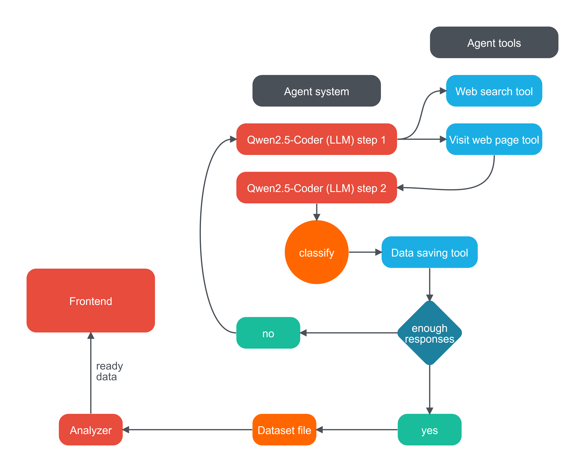

# Аналитические артефакты и описание проекта
Вторым этапом опишите аналитические артефакты. Используйте доступные и известные вам инструменты для описания: текст, таблицы, схемы и диаграммы. В информации ниже представлен порядок описания артефактов, вводная информация  и наводящие вопросы по каждому из них. 

Результат выполения этой части хакатона - это техническое задание на разработку решения вашей идеи.

**Порядок описания аналитических артефактов:**
## 1) Основные объекты продукта

Агентская система на основе языковой модели, тщательно проинструктированной на выполнение нашей задачи, имеет возможность пользоваться инструментами поиска в сети при помощи браузера и посещать веб страницы, чтобы находить отзывы. Когда она находит отзывы, она классифицирует их эмоциональную окраску, определяет предмет отзыва и сохраняет отзыв. Когда сохранено достаточное количество отзывов, они отправляются в анализирующий модуль, который считает по ним различные статистики и передает фронтенду, визуализирующему их на сайте. Ниже представлена диаграмма взаимодействий модулей нашего проекта.

   

## 2) Ролевая модель

Нашими пользователями является аналитический отдел компании S7
Они изучают статистическую информацию, полученную с помощью нашей системы.
В нашей системе у пользователей должна быть роль администратора и роль аналитика. Администратор может добавлять новых пользователей. 

## 3) Пользовательские/Функциональные/Нефункциональные требования

### Пользовательские требования
1. Система должна предоставлять удобный веб-интерфейс для просмотра аналитики
2. Все графики должны быть интерактивными с возможностью получения детальной информации
3. Система должна иметь теоретическую возможность реализации экспорта данных

### Функциональные требования
1. Автоматическая категоризация отзывов
2. Анализ тональности текста отзывов
3. Генерация статистики по категориям
4. Визуализация данных в виде графиков:
   - Круговая диаграмма распределения по категориям
   - Столбчатая диаграмма количества отзывов
   - Тепловая карта тональности по категориям
5. Система аутентификации и авторизации

### Нефункциональные требования
1. Производительность:
   - Время загрузки страницы < 5 секунд
2. Безопасность:
   - Шифрование паролей
   - HTTPS протокол
3. Масштабируемость:
   - До 100 одновременных пользователей
4. Доступность:
   - Время работы системы 99.9% 
   

## 4) Прототипы интерфейса
Мы отображаем данные в интерактивной форме отчета.

схема наших экранных форм основной страницы:
+----------------------------------+
|   Header           User Menu     |
+----------------------------------+
|                                  |
|     Столбчатая диаграмма         |
|     (количество отзывов)         |
|                                  |
+----------------------------------+
|                                  |
|     Круговая диаграмма           |
|     (распределение категорий)    |
|                                  |
+----------------------------------+
|                                  |
|     столбчатая диаграмма         |
|     (тональность по категориям)  |
|                                  |
+----------------------------------+
Схема нашей страницы входа в систему
+----------------------------------+
|                                  |
|             Logo                 |
|                                  |
|             Title                |
|     +--------------------+       |
|     |      Логин         |       |
|     +--------------------+       |
|     +--------------------+       |
|     |      Пароль        |       |
|     +--------------------+       |
|                                  |
|        [    Войти    ]           |
|                                  |
+----------------------------------+

## 5) Перспективы расширения системы

>Во-первых, мы бы улучшили инструмент парсинга сайтов. На данный момент он работает достаточно примитивно и часто пропускает отзывы. Во-вторых, стоит более тщательно продумать взаимодействие агентской языковой модели с инструментами, поскольку иногда она сбивается и делает немного не то. В-третьих, мы бы улучшили наш интерфейс, добавив функции экспорта файлов и графиков, также сделать возможность экспорта датасета, дать пользователям возможность самим определять, какие графики они хотят видеть. Добавить анализ того, на каких сайтах больше всего упоминается компания S7. Добавить больше признаков отзывов, классифицируя их не только по предметной области и эмоциональному окрасу, таким образом собирая более информативный датасет. 

