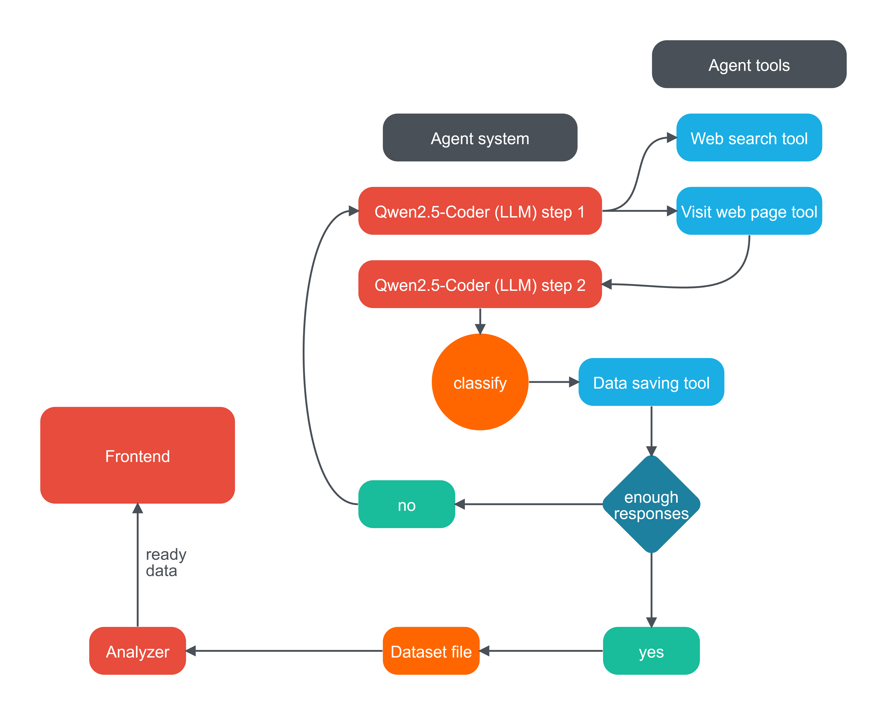

# Техническое решение

Третьим этапом приложите технические артефакты.

**Технические артефакты:**

## 1) Описание архитектуры решения

- Диаграмма, описывающая наше решение. 

   

- Укажите используемые языки программирования, фреймворки и библиотеки.
- Укажите используемые базы данных, брокеры сообщений и иную инфраструктуру, необходимую для работы вашего решения.

### Технологический стек

#### Языки программирования и фреймворки
- Backend: Python 3.11
- Frontend: HTML5, CSS3, JavaScript
- Web Framework: Flask 2.3.3
- Визуализация: Chart.js

#### Основные библиотеки
- Flask-Login 0.6.3 - аутентификация пользователей
- Werkzeug 2.3.7 - WSGI утилиты
- Gunicorn 21.2.0 - WSGI HTTP сервер
- smolagents - фреймворк для агента HuggingFace
- selenium - для управления драйвером браузера

### Инфраструктура
- Хостинг: Vercel
- База данных: Файловое хранилище (dataset.txt)
- Развертывание: Serverless
- Поисковая система: драйвер браузера geckodriver

### Источники данных
- наша система ищет данные самостоятельно, в этом и заключается её основная отличительная особенность. 
### Модель
- мы используем ML модель Qwen2.5-Coder-32B-Instruct внутри агента. Мы разработали для неё несколько инструментов, благодаря которым она может выполнить нашу задачу, и проинструктировали её, как именно ей следует их использовать. 
### Возможности масштабирования системы
- есть возможность расширения нашей системы до полноценного аудита бренда
- если добавить даты к отзывам и обучить модель, предназначенную для обработки последовательностей, можно попробовать предсказывать тренды.
- возможно реализовать переход на микросервисную архитектуру
- если инференсить модель локально, а не на серверах Hugging Face, то производительность системы значительно вырастет. Но для этого понадобятся вычислительные мощности.
### Мокирование
- на данный момент мы используем файловое хранилище вместо базы данных. В будущем мы будем использовать sqlite. 

## Инструкция по развертыванию

### Локальное развертывание

1. Клонирование репозитория
`git clone <https://github.com/Takymu/s7-ai-wings>`

2. Установка зависимостей
`pip install -r requirements.txt`

3. Запуск приложения
`python frontend/app.py`

### Развертывание на Vercel

1. Подготовка к деплою
- Убедитесь, что все файлы на месте:
  - vercel.json
  - requirements.txt
  - api/index.py

2. Развертывание
`vercel`

### Системные требования

#### Минимальные требования
- Python 3.11
- 2GB RAM
- 1 CPU
- 1GB свободного места на диске

#### Рекомендуемые требования
- Python 3.11
- 4GB RAM
- 2 CPU
- 5GB свободного места на диске

3) Исходный код решения

Исходный код решения находится в Tech, пример датасета в dataset.txt

4) [Демо-стенд, развернутый через versel](https://s7-hack-sz.vercel.app/login)

тестовые учетные записи

login: admin@s7.ru
password: s7admin

login: analyst@s7.ru
password: s7analyst